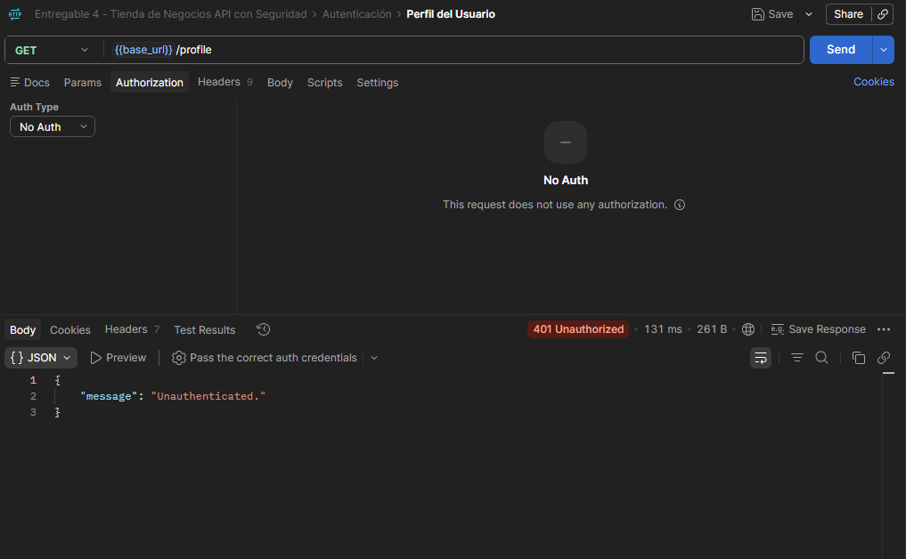
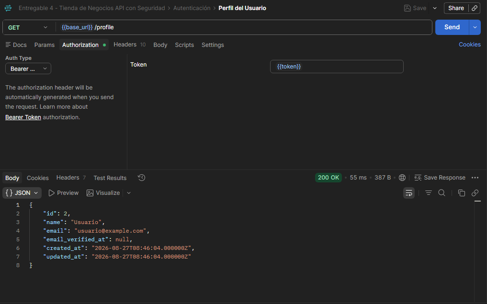

# Tienda de Negocios - Entrega 4
## Seguridad de la API con JWT, Autenticación y Protección contra Vulnerabilidades

¡Proyecto correspondiente a la cuarta entrega, elevando la seguridad de nuestra tienda en línea mediante la implementación de autenticación basada en JSON Web Tokens (JWT), middlewares de protección de rutas y mitigación de ataques comunes!

---

### 🎯 1. Objetivo del Trabajo

Proteger la API construida en la Entrega 3 mediante autenticación basada en JSON Web Tokens (JWT) y middlewares, aplicando buenas prácticas de seguridad para evitar vulnerabilidades comunes.

---

### 🔐 2. Autenticación basada en JSON Web Tokens (JWT)

Para cumplir con los estándares de seguridad de una API REST *stateless*, se implementó el paquete `php-open-source-saver/jwt-auth`. El ciclo de vida y la estructura del token operan de la siguiente manera:

* **Estructura del JWT:** Está compuesto por tres partes separadas por puntos (`.`):
  1. **Header (Cabecera):** Define el algoritmo de firma utilizado (ej. HS256).
  2. **Payload (Carga útil):** Contiene los claims o datos del usuario autenticado (como el `sub` o ID de usuario), fecha de emisión (`iat`), expiración (`exp`) y tiempo de vida. Por seguridad, **no se incluye información sensible** como la contraseña.
  3. **Firma (Signature):** Garantiza que el token no haya sido manipulado en tránsito, firmándose en el servidor con una clave secreta (`JWT_SECRET`).
* **Ciclo de Vida:**
  1. El usuario se registra (`/api/register`) o inicia sesión (`/api/login`) enviando sus credenciales.
  2. El servidor valida las credenciales y emite un token JWT firmado de duración controlada.
  3. El cliente almacena el token y lo envía en las subsecuentes peticiones dentro de la cabecera HTTP bajo el formato: `Authorization: Bearer <token>`.
  4. El middleware intercepta la petición, verifica la validez y firma del token, y permite el acceso al recurso o rechaza la petición con un código `401 Unauthorized` si el token es inválido, ha expirado o está ausente.

---

### 🗂️ 3. Endpoints Públicos y Protegidos (`routes/api.php`)

Las rutas de la API se dividieron estratégicamente utilizando un middleware de autenticación (`auth:api`):

#### 🔓 Rutas Públicas (No requieren token)
* `POST /api/register` - Registro de nuevos usuarios en el sistema.
* `POST /api/login` - Autenticación de usuarios y emisión del JWT correspondiente.
* `GET /api/categorias` - Consulta general de categorías.
* `GET /api/productos` - Consulta general del catálogo de productos.

#### 🔒 Rutas Protegidas (Exigen un JWT válido en los Headers)
* `GET /api/profile` - Obtiene los datos del usuario autenticado actualmente.
* `POST /api/logout` - Invalida el token actual (cierre de sesión).
* **Gestión del Carrito de Compras:**
  * `GET /api/carrito` - Muestra los ítems del carrito del usuario autenticado.
  * `POST /api/carrito` - Agrega un producto al carrito.
  * `PUT /api/carrito/{id}` - Modifica la cantidad de un ítem.
  * `DELETE /api/carrito/{id}` - Remueve un producto del carrito.
  * `DELETE /api/carrito/vaciar` - Vacía el carrito por completo.
* **Proceso de Checkout y Órdenes:**
  * `GET /api/checkout/resumen` - Devuelve el desglose financiero del carrito.
  * `POST /api/checkout/confirmar` - Valida stock, procesa la orden y vacía el carrito.

---

### ⚠️ 4. Protección contra Vulnerabilidades Web Comunes

Para garantizar la integridad y seguridad de la aplicación, se incorporaron defensas estructurales apoyadas en el núcleo de Laravel:

* **SQL Injection:** Prevenido de manera nativa mediante el uso de Eloquent ORM y consultas preparadas con asignación de parámetros (*parameter binding*), neutralizando cualquier intento de inyección de código malicioso en las consultas a la base de datos.
* **CSRF (Cross-Site Request Forgery):** Al tratarse de una API REST moderna basada en autenticación por tokens JWT (*stateless*) y no en sesiones basadas en cookies del navegador, el vector de ataque CSRF queda descartado de forma nativa.
* **XSS (Cross-Site Scripting):** La arquitectura de la API opera exclusivamente transmitiendo datos estructurados en formato JSON (desacoplada de vistas HTML en el servidor), lo que evita la ejecución de scripts directos en el backend. La sanitización de entradas queda delegada de forma segura al cliente.
* **Hashing de Contraseñas:** Las credenciales de los usuarios jamás se almacenan en texto plano; se utiliza el algoritmo de cifrado robusto **Bcrypt** mediante las funciones nativas de encriptación de Laravel.

---

### 🚀 5. Instrucciones de Instalación y Pruebas con Seguridad

Para poner en marcha esta versión con JWT en tu entorno local:

1. **Requisitos previos**
   Tener PHP, Composer y MySQL activos (XAMPP).

2. **Instalar dependencias**
   Ejecuta en la terminal del proyecto:
   ```Bash
   composer install
   ```

3. **Configurar el entorno y las claves de seguridad**
Asegúrate de que tu archivo .env esté configurado con tu conexión a la base de datos y genera las llaves de encriptación y JWT ejecutando:

 ```Bash
 php artisan key:generate
 ```

 ```Bash
 php artisan jwt:secret
 ```

4. **Ejecuta las migraciones**
 ```Bash
 php artisan migrate --seed
 ```

5. **Inicia el servidor**
 ```Bash
 php artisan serve
 ```
 El servidor estara disponible en `http://127.0.0.1:8000`.

6. **Validación de Seguridad en Postman**
 * **Sin Token:** Intentar consumir /api/login u otro endpoint protegido sin la cabecera Authorization retornará un error HTTP 401 Unauthorized.
 

 * **Con Token:** Realizar una petición a POST /api/login para obtener el access_token, configurarlo como Bearer Token en Postman, y verificar que el acceso a los recursos protegidos responde con éxito (200 OK / 201 Created).
 

### 🛸 6. Autor del Trabajo
- **Nombre y Apellido**: Agustina Martinez Godoy
- **Email**: martinezgodoyagustin@gmail.com 

> ¡Disfrute del código!